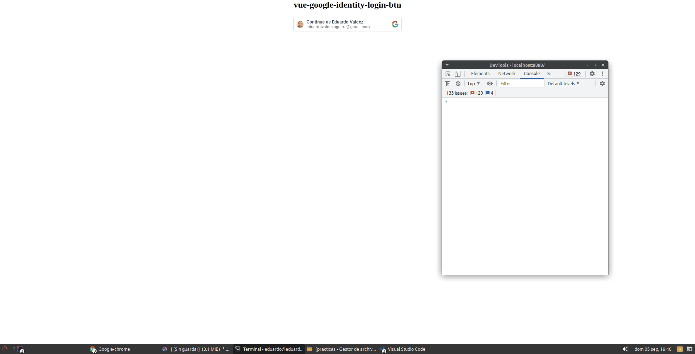

# vue-google-identity-login-btn

<br>

> Simple Google Login Button for vue ( Google Identity Services ).

<br>

---

 [vue-google-identity-login-btn](#vue-google-identity-login-btn)
  - [install](#install)
  - [Use](#use)
  - [Customize your login button](#customize-your-login-button)
  - [Full example](#full-example)


<br>

## install:

### yarn:

> $ yarn add vue-google-identity-login-btn

### npm:
> npm install --save vue-google-identity-login-btn

---

## Use:

1. Import the library in your component and adds the directive, data, and methods required:
   
``` js
import GoogleSignInButton from 'vue-google-identity-login-btn';
``` 

```js
export default {
  
  directives: {
    GoogleSignInButton
  },

  data() {
    return {
      clientId: 'YOUR-GOOGLE-CLIENT-ID'
    }
  },

  methods: {
    onGoogleAuthSuccess (jwtCredentials) {
      console.log(jwtCredentials);
      const profileData = JSON.parse( atob(jwtCredentials.split('.')[1]) );
      console.table(profileData);
    }
  },
}
</script>
```

<br>

2. Create an element with the `v-google-identity-login-btn` directive in your template:

```html
<div style="display: flex; justify-content: center" 
  id="google-login-btn"
  v-google-identity-login-btn="{ clientId }">
    Continuar con google
</div>
```
<br>

> Warning: If you are seeing this message and you have issues (the Google button is not showing and you have an error in the console), probably you need to specify the `width` property with an Number value
> ( `v-google-identity-login-btn="{ clientId, width: 300 }">` ).
> you can see more details [here](https://github.com/eduardova/vue-google-identity-login-btn/pull/1)

### `important:` The container `id` (in this case `google-login-btn`) is required.

<br>

> Tip: dont forget [validate the jwtCredentials in yout backend](https://developers.google.com/identity/gsi/web/guides/verify-google-id-token)

<br>

## Customize your login button:

<br>

### Put attention in the object from the directive: 


> v-google-identity-login-btn="`{ clientId }`"

<br>

This object can contains the [attributes for the GsiButtonConfiguration](https://developers.google.com/identity/gsi/web/reference/js-reference#GsiButtonConfiguration) that change your login button theme, lang, size, etc.

<br>

## Default and required options:

attribute|status|type|default|
:---|:---|:---|:---
clientId|required|string|-
type|optional|string|"standard"
shape|optional|string|"rectangular"
theme|optional|string|"outline"
text|optional|string|"continue_with"
size|optional|string|"large"
locale|optional|string|"es-419"
logo_alignment|optional|string|"center"
width|optional|string|"300px"

<br>

## full example:

```html
<template>

    <div class="btn-cont">
      <div><h2>vue-google-identity-login-btn</h2></div>
      <div id="google-login-btn" v-google-identity-login-btn="{ clientId, locale:'en' }">
          Continuar con google
      </div>
    </div>

</template>

<script>
import GoogleSignInButton from 'vue-google-identity-login-btn';

export default {
  
  directives: {
    GoogleSignInButton
  },

  data() {
    return {
      clientId: 'YOUR-CLIENT-ID'
    }
  },

  methods: {
    onGoogleAuthSuccess (jwtCredentials) {
      // console.log(jwtCredentials);
      const profileData = JSON.parse( atob(jwtCredentials.split('.')[1]) );
      const { name, picture, email } = profileData;
      console.table({ name, picture, email });
    }
  },
}
</script>

<style scoped>
.btn-cont {
  display: flex;
  flex-direction: column;
  align-items: center;
  height: 500px;
}
.btn-cont > div {
  width: 300px;
  text-align: center;
}
</style>

```

### result:

